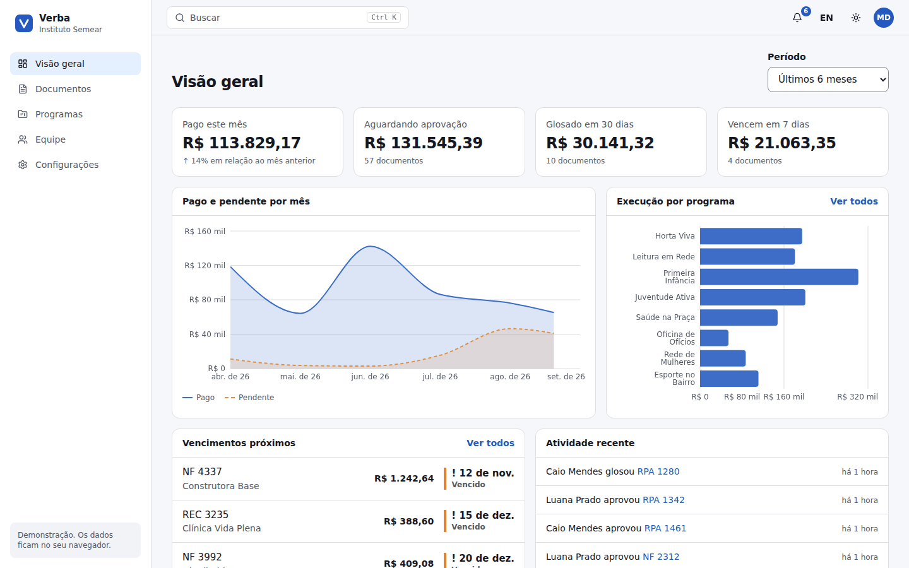
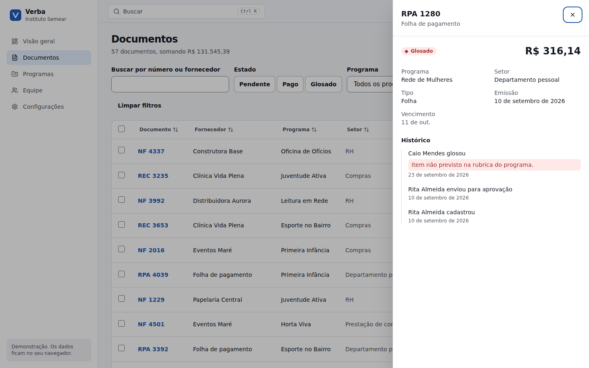
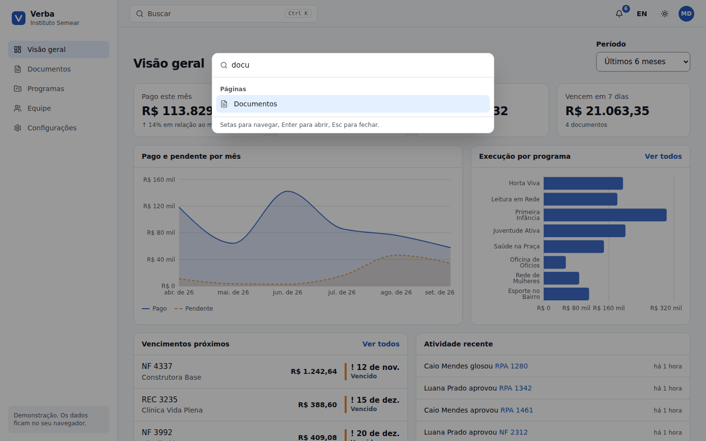
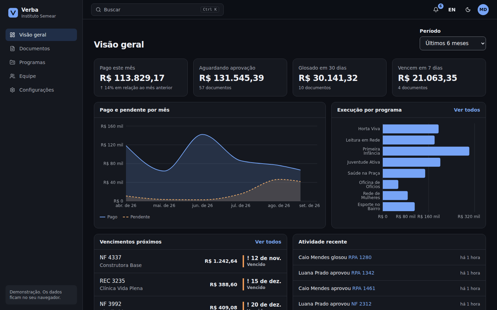
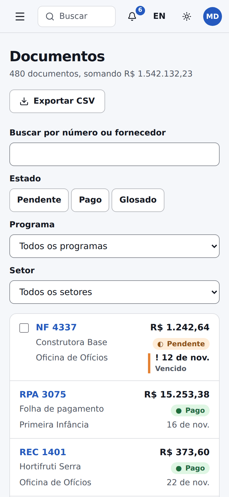

# Verba

A finance operations dashboard for nonprofits: documents, programs, approvals and team in one place. Built with React 19, TypeScript, Tailwind CSS v4, Radix UI, TanStack Query and Recharts. It runs entirely in the browser against a mock API, so it deploys as a static site.

[Leia em português](README.pt-BR.md)



## What is in it

- **Overview.** Four indicators (paid this month with the change from last month, awaiting approval, rejected in the last 30 days, due in 7 days), an area chart of paid and pending by month, spending by program, upcoming due dates and recent activity.
- **Documents.** A dense table of 480 documents with search, state, program and department filters, sorting, pagination and a filtered total.
  - Pending documents can be selected and approved or rejected in bulk; rejecting requires a written reason, which goes into the history.
  - A side sheet shows each document and its history.
  - Export to CSV opens cleanly in Excel: BOM, semicolons and decimal commas in Portuguese.
  - Filters live in the URL, so a filtered view can be shared.
- **Programs.** Budget, spent and committed for each program, a monthly spending chart and the top suppliers.
- **Team.** Invite people with validation (duplicate emails are caught), change roles and remove members, with a seat limit.
- **Settings.** Profile, preferences (language, theme, table density) and plan usage.
- **Command palette.** `Ctrl K` or `⌘K` jumps to pages, programs and documents, and runs actions.
- **Portuguese and English.** Every string, plus currency, dates and numbers formatted per locale with `Intl`.
- **Light, dark and system themes**, with no flash on load.
- **Loading, empty and error states** everywhere. Turning on "Simulate network failures" in Settings makes every read fail, so the error states and retries can be seen.

| Documents, with the side sheet open | Command palette |
| --- | --- |
|  |  |

| Dark theme | Mobile |
| --- | --- |
|  |  |

## Decisions worth reading

**Color is never the only signal.** Each state has a symbol and a word as well as a color: ● paid, ◐ pending, ◆ rejected.

**Five deadline bands, one warning hue.** The deadline scale has five bands but the brand has one warning color, so the three warnings are three steps of the same orange. Overdue is marked by weight and a `!`, not by a second hue. Otherwise the screen would tell you a document is overdue and rejected at once.

**Contrast is tested, not eyeballed.** `src/lib/tokens.test.ts` reads the OKLCH tokens straight from `styles.css` and checks 18 pairs in both themes against WCAG 2.1: 4.5:1 for text and 3:1 for control borders and focus rings. Change a token and the test fails before anyone sees it.

**Accessibility is part of the component, not an afterthought.**
- The command palette is a combobox where focus never leaves the input: the active option is announced with `aria-activedescendant`.
- Sortable headers carry `aria-sort`.
- Charts are hidden from screen readers and replaced by a table with the same numbers.
- Every field has a visible label and its error is tied to it with `aria-describedby`.
- After navigation, focus moves to the page heading.
- There is one polite live region for confirmations.
- The app passes axe with zero violations on every page, in both themes.

**Dense tables without horizontal scrolling.** The documents table turns into cards through a container query, so it responds to the width it is given, not to the window.

**The API is a single door.** `src/api/client.ts` is the only thing the UI calls. It adds latency, can fail on purpose and keeps your changes in `localStorage`. Replacing it with `fetch` calls to a real backend changes nothing above it.

## Run it

```bash
npm install
npm run dev        # http://localhost:5173
npm test
npm run build      # static files in dist/
```

Sign in with any valid email and a password of six characters or more, or use the demo account button.

It deploys to Vercel as-is: `vercel.json` rewrites every route to `index.html` for client-side routing.

## Tests

81 tests with Vitest and Testing Library, all written against roles, accessible names and the keyboard rather than class names:

- interface flows: 14
- queries and derived numbers: 20
- the in-browser database: 7
- theme contrast: 36
- CSV: 4

CI runs the type check, the tests and the build on Node 20 and 22.

## Structure

```
src/api/         types, seeded data, pure queries, in-browser database, API client, TanStack Query hooks
src/app/         providers (preferences and i18n, auth), app shell, command palette
src/components/  UI primitives (button, fields, badges, dialogs, sheet, toasts, states) and charts
src/pages/       overview, documents, programs, team, settings, login, not found
src/i18n/        Portuguese and English dictionaries
src/lib/         CSV, color and contrast helpers
```

Each page is its own chunk, so the charting library only loads on the pages that draw charts.

## The data

Everything is fictional: Instituto Semear, its eight programs, suppliers and people. The data is generated from a fixed seed on every load, so it is the same for everyone, and dates are relative to today so deadlines stay meaningful.

## License

MIT
